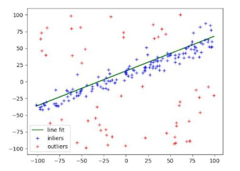

# Project - Least Squares, Random Sample Consensus based Outlier Rejection
This project implements the Least Squares Technique using Vertical and Perpendicular distances approach for Line Fitting
This project also implements Random Sample Consensus(RANSAC) technique to perform outlier rejection

<em>Line Fitting after RANSAC</em>

## Dependencies
python 3.5 minimum
numpy

## Data
The project uses the pickled data 
`data/data1_new, data/data2_new, data/data3_new` 

## Execution
Execute below script for Least Squares implementation as follows

`python3 src/HW1_all_data.py`

Execute below script for RANSAC implementation as follows

`python3 src/HW1_all_RANSAC.py`

## Results
Results are shown in doc/ENPM673_HW1_Report.pdf
